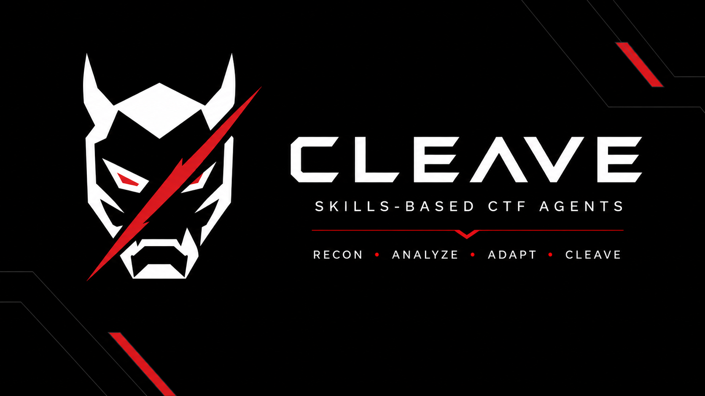

<p align="center">
  
</p>

<h1 align="center">CLEAVE</h1>

<p align="center">
  <strong>Skills-Based CTF Agents</strong><br>
  RECON &bull; ANALYZE &bull; ADAPT &bull; CLEAVE
</p>

CLEAVE is a mechanics-first skill framework for AI agents working CTF challenges.
It routes from observable evidence to the right offensive-security technique:
binary artefacts, dependency manifests, protocol hints, file signatures, challenge
outputs, and exploit behavior. The goal is precise agent orchestration: inspect
the signal, load only the relevant skill context, adapt the attack path, and cut
through the challenge.

The project includes CTF skills for pwn, crypto, web, reverse engineering,
forensics, misc, OSINT, malware, app-system work, and automation, plus associated
agent memory.

## Agent Model

- **Recon**: identify challenge signals before choosing a path.
- **Analyze**: map evidence to narrow skill dispatch tables.
- **Adapt**: load detailed support files only when the technique needs them.
- **Cleave**: execute focused attack loops with minimal context noise.

SKILL.md files stay lean and dispatch-oriented. Quick-reference code and
per-technique detail live in support files loaded on demand.

## Layout

```text
assets/
  cleave-banner.png        # GitHub README header
  cleave-logo-on-dark.png  # black-background logo variant
  cleave-logo-on-light.png # light-background logo variant
skills/
  ctf-automation/          # triage.sh + per-category setup scripts
  ctf-pwn/                 # binary exploitation
  ctf-crypto/              # RSA, ECC, lattice, PQ, ZK
  ctf-web/                 # server-side, client-side, auth, web3
  ctf-reverse/             # static + dynamic + language-specific reversing
  ctf-forensics/           # disk, memory, network, signals, stego
  ctf-misc/                # jails, encodings, RF, AI/ML/LLM exploits
  ctf-malware/             # obfuscation, C2, PE/.NET
  ctf-osint/               # geolocation, social, web/DNS
  ctf-app-system/          # Root-Me SSH-only workflow and system targets
memory/
  MEMORY.md                # index
  feedback_*.md            # skill authoring and triggering rules
  project_*.md             # research passes, lessons, and session artefacts
install.sh                 # bootstrap symlinks into ~/.claude
```

## Install

```bash
git clone git@github.com:MateoBogo/CLEAVE.git ~/cleave
bash ~/cleave/install.sh
```

The install script symlinks every `skills/ctf-*` directory into
`~/.claude/skills/` and every `memory/*.md` file into the active Claude Code
project memory directory. Re-run it any time the set of files changes.

## Working Loop

1. Edit skills in place. Symlinks keep everything live under
   `~/.claude/skills/ctf-*`.
2. Run `bash skills/ctf-automation/triage.sh <challenge-dir>` to generate a
   signal-first challenge summary.
3. Commit and push from the CLEAVE repository root.
4. On another machine, run `git pull` and then re-run `bash install.sh`.

## Skill Authoring Rules

See `memory/feedback_skill_authoring_budget.md` and
`memory/feedback_skill_triggering_by_mechanics.md`. In short:

- Every section leads with `Trigger:`, `Signals:`, or `Pattern:`.
- Dispatch hooks must be observable. Challenge names are references, not routing
  keys.
- Keep code out of `SKILL.md`; put code in support files or `quickref.md`.
- Add one row per technique to `SKILL.md#pattern-recognition-index`.
- If a support file grows past roughly 500 lines, split it into a sibling file.

## Triage Entrypoint

```bash
bash skills/ctf-automation/triage.sh <challenge-dir>
```

The command writes `<dir>/.ctf-triage.json` and `<dir>/.ctf-triage.md`, pointing
the agent straight into the relevant `SKILL.md#pattern-recognition-index` rows.

## License

Personal use. No warranty.
